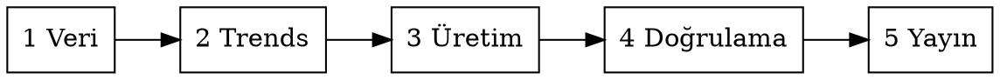

# Aylık Arama Talebi Raporu

## Overview

Bir markanın keyword hacim geçmişinden ve canlı Google Trends verisinden, **her ay tekrarlanan** bir talep raporu üretir. Cevapladığı soru sabittir:

> Önümüzdeki ay hangi başlıklar aranmaya başlayacak, bu hareket hangi hafta başlıyor, geçen yıla göre nasıl gidiyor?

Üç çıktı verir: **web raporu** (asıl teslim), **e-posta özeti** (gövdeye yapıştırılır), **Excel** (çalışma dosyası). Üçü de aynı hesap katmanından beslenir; sunum katmanları ayrışır.

**Temel ilke:** İki veri kaynağı iki farklı soruyu yanıtlar ve **karıştırılmaz**. Keyword Planner geçmiş takvim yıllarının mutlak hacmini verir ("bu ay normalde ne kadar aranır"). Google Trends son 12 haftalık göreli ilgiyi verir ("bu yıl da işliyor mu"). Dönemleri farklıdır, ölçekleri kıyaslanamaz.

## When to Use

- Bir marka için aylık tekrarlanan arama talebi / sezonsallık raporu isteniyor
- Elde keyword bazlı aylık hacim geçmişi var (GKP export, SEOmonitor, Ahrefs)
- "Kategori ve pazarlama ekipleri ay başlamadan ne hazırlamalı" sorusu soruluyor

**Kullanma:** tek seferlik keyword araştırması, rakip analizi, içerik brief'i, teknik SEO denetimi. Bunların kendi skill'leri var.

## Süreç



### 1. Veri hazırlığı

Girdi tek bir JSON: `keywords[]` (zorunlu) + `brands[]` (opsiyonel). Şema ve GKP export'undan dönüştürme: **references/veri-sozlesmesi.md**

**Keyword listesi yoksa:** SEOmonitor'da takip edilen kelimelerden başlanır (`seomonitor_get_keyword_data`, `seomonitor_get_keyword_vault_data`). Bunlar marka için zaten seçilmiş kelimelerdir, hacim geçmişi de gelir. Ahrefs `keywords-explorer-volume-history` de aynı işi görür. Hangi kaynağı kullandığın raporun kapsam notuna yazılır.

### 2. Google Trends çekimi

Yükselen başlıkların canlı seyri DataForSEO'dan çekilir. **Kural: her keyword ayrı istekte.** Toplu çekim düşük hacimli kelimeyi ezip kullanılamaz hale getirir. Ayrıntı, vekil terim ve seyrek veri: **references/trends-cekimi.md**

Pencere `past_12_months` ile değil **açık tarihle** istenir: Pazar başlar, son tamamlanmış Cumartesi biter, 53 tam hafta. `past_12_months` çekim gününün yarım haftasını serinin sonuna ekler ve "şu an" değeri düşük okunur. Geçmiş aylar kendi ay sonu penceresiyle bir kez çekilip dondurulur.

```bash
node scripts/havuzlar.js --config proje.json > havuzlar.json
python3 scripts/trends/plan.py havuzlar.json --yil 2026 --vekil vekil.json   # istek.json + pencere-plani.json, maliyeti yazar
python3 scripts/trends/kimlik.py "$TMP/.curlrc"                              # dfs-mcp kimliğinden, 600 izin
TRENDS_CURLRC="$TMP/.curlrc" python3 scripts/trends/cek.py istek.json ham.json
python3 scripts/trends/dagit.py ham.json pencere-plani.json havuzlar.json veri.json
rm "$TMP/.curlrc"
```

Kimlik dosyası oturumun geçici dizinine yazılır ve çekimden sonra silinir. `dagit.py` her ayın penceresini doğrular (Pazar, Cumartesi, 53 kova), anlam karışması şüphesi taşıyan tek kelimelik başlıkları listeler ve `trends-<ay>.json` dosyalarını yazar. Maliyeti `plan.py` çekimden önce yazar; kullanıcı onayı çekimden önce alınır.

### 3. Üretim

```bash
node scripts/build-web.js       --config proje.json --ay 11 --trends-stdin < trends.json
node scripts/build-mailing.js   --config proje.json --ay 11 --trends-stdin < trends.json
node scripts/build-excel-data.js --config proje.json --ay 11 --trends-stdin < trends.json --out out/excel.json
python3 scripts/build-excel.py out/excel.json out/rapor.xlsx
```

`proje.json` markaya özel her şeyi taşır (ad, veri yolu, dönem yılları, logolar, ay sekmeleri). Şablonlar marka bilmez. Örnek: `ornek/proje.json`

Metrik tanımları ve eşikler: **references/metrikler.md** · Bölüm yapısı ve metin kuralları: **references/rapor-yapisi.md**

### 4. Doğrulama

Teslimden önce tarayıcıda **fiilen** test et. Bu raporda daha önce sessizce kırılmış olan davranışların listesi ve kök nedenleri: **references/on-yuz-tuzaklari.md**

Teslim kontrol listesi: **references/teslim-kontrol.md**

### 5. Yayın

Çıktı ayrı bir depoya konur ve Vercel'e bağlanır. Veri deposu **salt okunur** kalır; rapor üretimi hiçbir dosyasını değiştirmez.

## Markaya Göre Değişenler

| Bölüm | Koşul |
|---|---|
| Yükselen başlıklar, Alt kategori, Adımlar | Her markada |
| Google Trends Insight'ları | Trends çekildiyse |
| Alt kırılımda büyüyenler | Kat 3 kırılımı varsa |
| **Katalogda yer almayan büyüyen markalar** | **Yalnızca kendi kataloğunu bilen markada** |

Son satır önemli: bu bölüm markanın sattığı markalar listesi (`brands[].catalog`) olduğunda anlamlı. Çoğu markada böyle bir veri yoktur. `brands` boşsa bölüm hem web'de hem Excel'de **hiç açılmaz** ve içindekiler kendini buna göre kurar. Boş bölüm bırakma.

## Bu Rapordaki Kararlar ve Nedenleri

Bunlar tartışılıp karara bağlanmış noktalar. Yeniden açmadan önce nedenini oku.

| Karar | Neden |
|---|---|
| "Mevsimsel yükselen" = **iki yılda da** yıl ortalamasının %15 üzeri | Tek yıllık sıçrama mevsimsellik kanıtı değil |
| Trends her keyword için **ayrı istek** | 0-100 ölçeği istek içinde normalize; toplu çekim küçük kelimeyi eziyor |
| Trends penceresi **son tamamlanmış Cumartesi**'de biter | `past_12_months` son kovası yarım hafta; ölçüldü: medyan -%11, 337 başlığın 51'inde boş kova |
| Geçmiş ay **kendi ay sonu penceresiyle** dondurulur; son kova ayın son gününü içeren hafta | Üç metrik de serinin son haftasına bağlı; Ocak sayfası bugünkü pencereyle Eylül'ü gösterir |
| Trends penceresi GKP yıllarından **ayrı etiketlenir** | Trends son 12 ay, GKP takvim yılı. Karıştırmak "Eyl 24" gibi yanlış etiket üretir |
| Rapor **tek HTML dosya**, logolar `data:` URI | İçerik güvenlik politikası dış kaynağı engelleyebiliyor, dosya taşınabilir kalmalı |
| Kaydırılabilir tablo + filtre, kırpma yok | Havuzun tamamı gösterilir; "ilk 30" demek kalanı gizlemek olur |
| Hacim değerleri "yön göstergesi" şerhiyle | GKP hacimleri bantlanmış, mutlak doğru değil |
| Web ve e-posta **ayrı şablon** | E-posta istemcisi script, flex/grid ve `data:` görsel desteklemiyor |

## Dikkat Edilecekler

- **Veri bulunamadıysa uydurma.** Rapora placeholder metrik, "sonraki sürümde eklenecek" vaadi veya boş bölüm bırakılmaz. Durum chat'ten bildirilir, veri istenir, gelmiyorsa alan çıkarılır.
- **Raporun kendi vaatlerini doğrula.** "Çubuğun üzerine gelince tarih ve değer görünür" gibi bir not yazdıysan, gerçekten görünüyor mu bak. Bu rapor bu hatayı bir kez yaptı.
- **Ölçüm yapılmadı ≠ veri yok.** Excel'de ve tabloda ikisi ayrı işaretlenir, sözlükte açıklanır.
- **Marka adı şablonlara sabit yazılmaz.** `proje.json`dan gelir. Sızıntı kontrolü: `grep -ri "<önceki marka>" scripts/`
- Dil ve biçim İçerik Dili Rehberi [A] rejimine tabidir: em dash yok, şapkalı harf yok, `%X` biçimi, `1.27x` çarpan, `➔` insight oku.

## Haftalık ve Aylık Tekrar

**Haftalık (Pazar veya Pazartesi):** yalnızca Trends güncellenir, Keyword Planner hacimleri değişmez. İçinde bulunulan ay ve sonrası ortak pencereyle yeniden çekilir, geçmiş aylar atlanır:

```bash
python3 scripts/trends/plan.py havuzlar.json --yil 2026 --donmuslari-atla
```

Rutin olarak kurulabilir: `ornek/haftalik.sh` plan, çekim, dağıtım, derleme, kontrol, yayın ve canlı doğrulamayı tek betikte yapar; aynı pencereyi iki kez satın almaz, kontrol hatasında yayınlamaz, `--kuru` ile harcamasız denenir. Zamanlanmış görev bu Mac'te çalışmalıdır (bulutta kimlik ve üretim klasörü yok); görev yalnızca betiği bir kez çalıştırıp sonucu raporlar.

Hafta ortasında çekmek yeni bir hafta kazandırmaz; son tam Cumartesi aynı kalır, aynı pencere yeniden satın alınmış olur. Bir ayın son haftalık turu o ayın dondurma çekimidir; ertesi turda `dagit.py` o ayın dosyasını korur, yalnızca `donmus` işaretini açar ve sayfa yeniden üretildiğinde "Canlı" yerine "Ay Sonu" der.

**Aylık:** ay değiştiğinde `proje.json` içinde `hazirAylar` güncellenir. "Değerlendirilebilecek adımlar" bölümü haftalık turda değişmez; aktif ayların adımları o ayın verisini taşıyan ilk haftalık turda kendiliğinden yenilenir, geçmiş ayların adımları nihaidir (`references/rapor-yapisi.md`, Adımlar). Eşikler ve tanımlar **değiştirilmez** - aylar arası kıyas ancak sabit tanımla mümkün. Eşik değişecekse gerekçesi yazılır ve o ayın raporunda belirtilir.

## Kurulum

`scripts/` altındaki makine kendi kendine yeter. Node 18+ ve `openpyxl` gerekir:

```bash
pip install openpyxl
```

Yeni marka için: `ornek/` klasörünü kopyala, `proje.json` içindeki alanları doldur, logoları koy, veriyi `veri.json` olarak ver.
